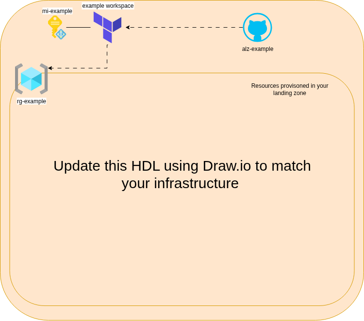

# Architecture

Deploymenet date: Update me
Owner email: Update me

## Overview

<!-- Describe the high-level architecture of your application -->

## Architecture Diagram

The high-level design is maintained in the draw.io file: 

**To edit the diagram:**
1. Open `architecture.drawio` in [draw.io](https://app.diagrams.net/) or VS Code with the Draw.io extension
2. Update the placeholder resources with your actual architecture
3. Export as PNG/SVG so we can embed the image in documentation

## Data Flow

<!-- Describe how data flows through your application -->

## Security

<!-- Describe security considerations and implementations -->

## Other 

<!-- Describe any other things that is nice to know about the workload -->